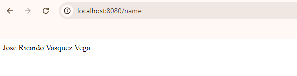

# Name Server

This code defines a simple REST microservice in Spring Boot that responds with a name when an HTTP GET request is made. The file **NameServiceApplication.java** contains the main class that starts the application using SpringApplication.run(). The class **NameController.java** defines a REST controller with the **@RestController** annotation, and the **getName()** method is mapped to the **/name** route using **@GetMapping**, allowing the server to respond with a text message containing the specified name when a client makes a GET request to that route.


## Starting and Installing

1. Clone the repository and navigate into the project directory:
    
    ```bash
    git clone https://github.com/Richi025/NameService.git  
    ```

2. Open de proyect and Build the project:
    
    ```bash
    mvn clean package
    ```

    Should display output similar to:

    ```bash
    [INFO] BUILD SUCCESS
    ```

3. Run the application:
    
    ```bash
    java -jar target/Nameservice-0.0.1-SNAPSHOT.jar
    ```

4. Access the API at: `http://localhost:8080/name`

   


## Built with

* [Spring Boot](https://spring.io/projects/spring-boot) - To build the controllers and backend services  


## Versioned

We use [Git](https://github.com/) for version control. For available versions, see the tags in this repository.

## Authors

* **Jose Ricardo Vasquez Vega** - [Richi025](https://github.com/Richi025)

## Date

Wednesday, October 01, 2024

